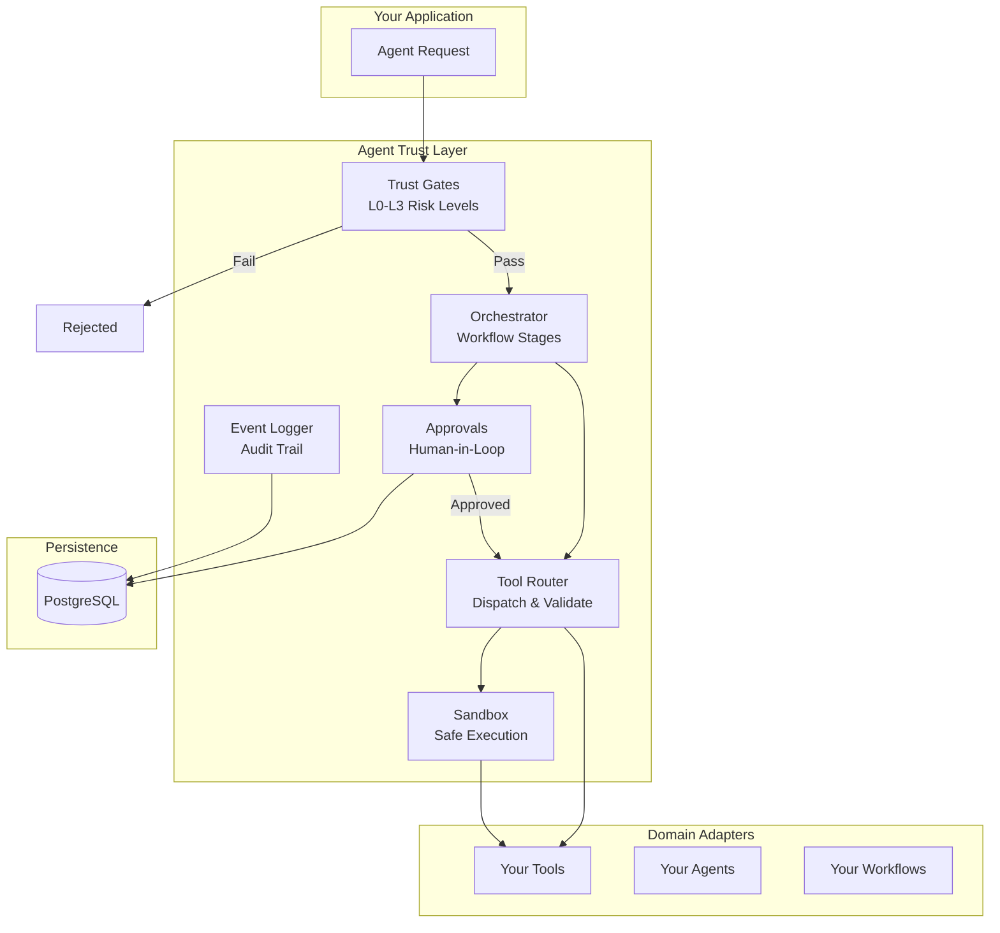

# Agent Trust Layer

[](https://www.npmjs.com/package/agent-trust-layer)
[](https://opensource.org/licenses/MIT)
[](https://www.typescriptlang.org/)
[](https://github.com/kauf3r/agent-trust-layer/actions/workflows/ci.yml)

A security and governance framework for AI agent operations. Enforce trust levels, audit actions, require approvals for risky operations, and orchestrate multi-agent workflows safely.

## Why Agent Trust Layer?

As AI agents become more capable, they need guardrails. ATL provides:

- **Trust Gates** - Validate operations against configurable trust levels before execution
- **Audit Logging** - Complete trail of all agent actions for compliance and debugging
- **Approval Workflows** - Human-in-the-loop for high-risk operations
- **Sandboxed Execution** - Test dangerous operations safely before committing
- **Domain Adapters** - Plugin architecture for business-specific tools and workflows

## Architecture



### How It Works

1. **Request** → Agent wants to perform an action
2. **Trust Gate** → Validates risk level (L0=safe, L3=critical)
3. **Orchestrator** → Routes through workflow stages (plan→execute→review→commit)
4. **Tool Router** → Dispatches to appropriate tool handler
5. **Approvals** → High-risk actions require human approval
6. **Event Logger** → Every action is audited for compliance

## Installation

```bash
npm install agent-trust-layer
```

## Quick Start

```typescript
import { initATL } from "agent-trust-layer";

const atl = initATL({
  trustThreshold: 3,
  sandboxMode: false,
  logger: { enabled: true, destination: "console" },
});

console.log(atl.ready); // true
```

## Creating a Domain Adapter

Domain adapters let you plug your business logic into the ATL framework. Each adapter provides tools, agents, and workflows specific to your domain.

```typescript
import { createDomainAdapter, type RegisteredTool } from "agent-trust-layer";

// Define your tools
const tools: RegisteredTool[] = [
  {
    definition: {
      name: "acme.orders.get",
      description: "Fetch orders by date range",
      capability: "READ",
      risk: "LOW",
      executionMode: "DIRECT",
      verification: "NONE",
      inputSchema: { startDate: { type: "string" }, endDate: { type: "string" } },
    },
    handler: async (args) => {
      // Your implementation here
      return { orders: [] };
    },
  },
];

// Create the adapter
const adapter = createDomainAdapter({
  domain: "acme",
  name: "Acme Corp",
  version: "1.0.0",
  tools,
  agents: [],
  workflows: [],
});
```

## Tool Classification

Tools are classified by capability and risk level:

| Field | Options | Description |
|-------|---------|-------------|
| `capability` | `READ` \| `PROPOSE` \| `WRITE` \| `SIDE_EFFECTS` | What the tool can do |
| `risk` | `LOW` \| `MEDIUM` \| `HIGH` \| `CRITICAL` | Risk classification |
| `executionMode` | `DIRECT` \| `SANDBOX_ONLY` | Where it can run |
| `verification` | `NONE` \| `RULES` \| `MULTI_AGENT` \| `HUMAN_APPROVAL` | Required verification |

## Agent Definitions

Agents execute workflow stages with specific roles:

```typescript
import type { AgentDefinition } from "agent-trust-layer";

const agents: AgentDefinition[] = [
  {
    name: "acme_planner",
    role: "planner",          // planner | worker | reviewer
    systemPrompt: "You gather information about orders...",
    allowedTools: ["acme.orders.get"],
    maxTurns: 5,
  },
  {
    name: "acme_worker",
    role: "worker",
    systemPrompt: "You fulfill orders...",
    allowedTools: ["acme.orders.get", "acme.orders.update"],
    maxTurns: 10,
  },
];
```

## Workflow Orchestration

Workflows orchestrate agents through stages:

```typescript
import type { WorkflowDefinition } from "agent-trust-layer";

const workflows: WorkflowDefinition[] = [
  {
    name: "daily_orders",
    domain: "acme",
    agents,
    stages: ["plan", "execute", "review", "commit"],
  },
];
```

**Standard stages:**
- `plan` - Gather information (L0-L1 tools only)
- `execute` - Take actions (L0-L2 tools, sandboxed writes)
- `review` - Verify output (must return PASS/FAIL verdict)
- `commit` - Finalize with side effects (L3+ may need approval)

## Database Setup

ATL uses PostgreSQL for audit logging and approval workflows. Apply migrations:

```bash
psql -d your_database -f migrations/001_agent_action_events.sql
psql -d your_database -f migrations/002_eval_runs.sql
psql -d your_database -f migrations/003_approval_requests.sql
psql -d your_database -f migrations/004_approval_decisions.sql
```

## Validation

Validate your domain adapter before registration:

```typescript
import { validateDomainAdapter } from "agent-trust-layer";

const result = validateDomainAdapter(adapter);
if (!result.valid) {
  console.error("Adapter errors:", result.errors);
}
console.log(`Tools: ${result.stats.toolCount}, Agents: ${result.stats.agentCount}`);
```

## Subpath Exports

Import specific modules for tree-shaking:

```typescript
import { TrustGate } from "agent-trust-layer/trust-gates";
import { Orchestrator } from "agent-trust-layer/orchestrator";
import { ToolRouter } from "agent-trust-layer/tool-router";
import { EventLogger } from "agent-trust-layer/logger";
import { ApprovalManager } from "agent-trust-layer/approvals";
import { Sandbox } from "agent-trust-layer/sandbox";
```

## Contributing

Contributions are welcome! Please read our contributing guidelines and submit PRs.

## License

MIT
